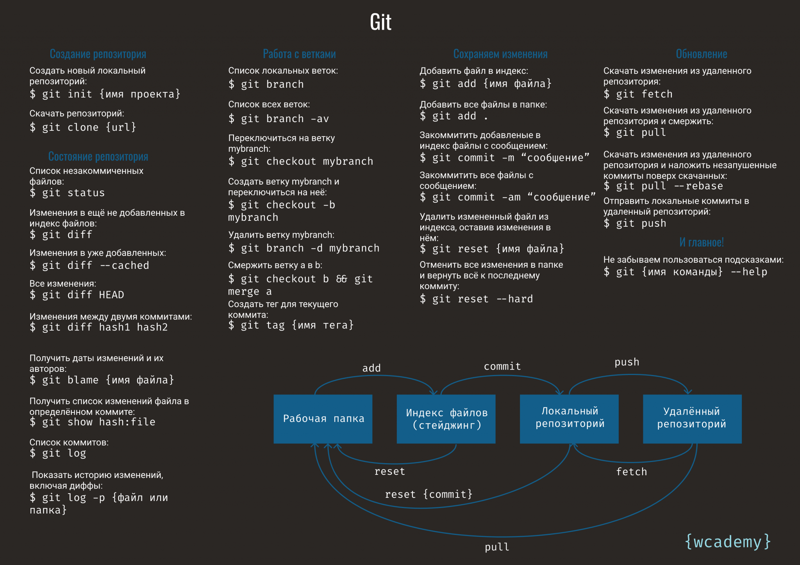

[< к соджержанию](./readme.md)


## git add

**git add *[файл]*** - добавляет файл в индекс.

Чтобы добавить все файлы в каталоге в индекс (кроме игнорируемых), используйте команду:
```bash=
git add .
```


## git init 

**git init** - создать пустой репозиторий

Создать пустой репозиторий Git или вновь инициализировать существующий можно параметром _init._ При инициализации он создаст скрытую папку. В ней содержатся все объекты и ссылки, которые Git использует и создаёт в истории работы над проектом.


## git status

**git status** - просмотр статуса

Просмотреть статус нужного репозитория можно по ключевому слову _status:_ его действие распространяется на подготовленные, неподготовленные и неотслеживаемые файлы.


## git commit

**git commit** - команда для записи индексированных изменений в репозиторий Git

При создании коммита в репозитории можно добавить однострочное сообщение с помощью параметра _commit с флагом -m._ Само сообщение вводится непосредственно после флага, в кавычках

Также можно открыть текстовый редактор в терминале для написания полного сообщения коммита. Оно может состоять из нескольких строк текста, в котором подробно характеризуются изменения, внесённые в репозиторий.

## git push

**git push** - отправка изменений в удалённый репозиторий.

Отправлять изменения в удалённый репозиторий можно параметром push с указанием имени репозитория и ветки. Эта команда передаёт локальные изменения в центральный репозиторий, где с ними могут ознакомиться другие участники проекта.


# Другие команды найдёте [тут](https://habr.com/ru/companies/ruvds/articles/599929/#1).   

## Небольшую шпаргалку мы тоже прикрепим


